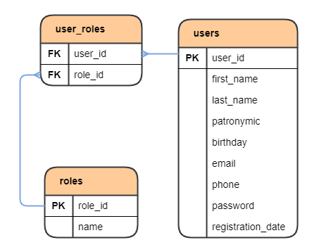

# User API

### Технологический стек:

1. Java 17;
2. Spring Boot 3;
3. Spring Security;
4. Apache Maven;
5. PostgreSQL;
6. Docker;
7. Hibernate;
8. Swagger;
9. Lombok;
10. Postman.

## _Описание проекта._

Backend часть приложения User API. 

User API - приложение для работы с данными пользователей.

## _Как запустить?_

1. Требуется ПК с Unix подобной ОС: Mac OS, Linux (например Ubuntu). Для остальных ОС требуется поднять виртуальную
   машину (например с помощью VirtualBox, WSL) с одной из Unix подобных ОС.
2. Установить Docker;
3. Клонировать репозиторий;
4. Создать jar файлы из модулей проекта, например через Intellij IDEA с помощью команды mvn package (при повторной
   пересборке рекомендуется использовать чистую сборку: mvn clean package);
5. Запустить приложение через терминал, из папки проекта, командой docker-compose up.

Локально, без Docker'a можно запустить проект на БД H2. Предварительно нужно сменить профиль
Спринга в модуле: uapi-service-server/src/main/resources/, файл: application.property, опция:
spring.profiles.active=test-db. После этого запускаем два микросервиса: UserApiGateway и UserApiServer,
в одноимённых модулях.

## _API спецификация_

При написании проекта применялась библиотека Swagger, для автоматического написания API документации.

### Ссылки на Swagger-ui

1. Ссылки при запуске на локальном устройстве:

http://localhost:8080/swagger-ui/index.html

http://localhost:8080/v3/api-docs

2. Также в папке проекта, в корневом каталоге есть финальная версия спецификации API в json формате.
   Путь к файлу:

user-api/uapi-swagger-spec.json

Её можно открыть через браузерную версию SwaggerEditor просто скопировав данные с json файла целиком, и
вставив их в окно, предназначенное под спецификацию в формате json и yaml. Ссылка на SwaggerEditor:

https://editor-next.swagger.io/

## _Query DSL, возможные проблемы_

Если среда разработки не воспринимает Q-объекты сгенерированные при компиляции, нужно отметить их как 
Generated Sources Root. Отметить нужно директорию:

user-api/uapi-service/uapi-service-server/target/generated-sources/java

## _Авто-тесты_

В корневой директории содержится json файл с возможностью импорта в приложение для тестирования API 
(Postman и подобные). Путь к файлу:

user-api/uapi-postman-test.json

Тесты следует запускать на чистой сборке. Можно запускать весь каталог сразу. После прохода тестов, 
для повторного прохода нужно пересобрать приложение с чистой БД.

## _База данных проекта_

### _Схема базы данных_

### _Описание базы данных_
1. Таблица `users`. Содержит данные о пользователях приложения.
    * _**user_id**_ (первичный ключ) - уникальный идентификатор пользователя;
    * _**first_name**_ - имя;
    * _**last_name**_ - фамилия;
    * _**patronymic**_ - отчество;
    * _**birthday**_ - дата рождения;
    * _**email**_ - электронная почта;
    * _**phone**_ - номер телефона;
    * _**password**_ - пароль от аккаунта;
    * _**registration_date**_ - дата и время регистрации в приложении.
2. Таблица `roles`. Содержит информацию о ролях пользователей. Сущность реализует уровень
   доступа пользователей к различным частям приложения.
    * _**role_id**_ (первичный ключ) - идентификатор роли;
    * _**name**_ - название роли.
3. Таблица `user_roles`. Обеспечивает связь многие ко многим между пользователями и их ролями.
    * _**user_id**_ (внешний ключ) - идентификатор пользователя;
    * _**role_id**_ (внешний ключ) - идентификатор роли.